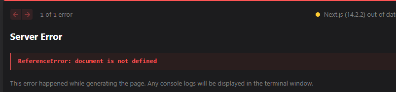

## How to fix “document is not defined” in Next.js

If you’re working with Next.js, you might have encountered the infamous **`document is not defined`** error. This error can be a roadblock, especially for those new to server-side rendering concepts in Next.js. But don’t worry, resolving this issue is straightforward once you understand the underlying cause and implement the right solutions.



### **Understanding the Error**

The **`document is not defined`** error in Next.js usually occurs when your code tries to access the **`document`** object, a part of the browser’s global window object, during server-side rendering. Next.js uses Node.js for server-side rendering, and Node.js doesn’t have access to **`document`**. This disconnect leads to the error. It’s a common issue for developers transitioning from client-side JavaScript frameworks, where accessing **`document`** is a regular practice.

### **Preliminary Checks**

Before delving into specific solutions, it’s crucial to perform some preliminary checks:

1. **Review Your Code**: Identify where you’re accessing the **`document`** object. It could be in lifecycle methods, outside components, or in third-party libraries.
2. **Environment Check**: Ensure that the problematic code runs only on the client side. A simple check like **`if (typeof window !== 'undefined')`** can help determine if you’re in a browser environment.
3. **Update Dependencies**: Sometimes, outdated dependencies can cause issues. Make sure your Next.js and other related packages are up to date.

## **Step-by-Step Solutions**

### **Using useEffect Hook**

The **`useEffect`** hook is a part of React’s Hooks API. It runs after the component mounts, which means it only executes on the client side. By wrapping your code that relies on the **`document`** object inside **`useEffect`**, you ensure it doesn’t run during server-side rendering. Here’s an example:

```
import React, { useEffect } from 'react';const MyComponent = () => {useEffect(() => {// Access document object hereconsole.log(document.title);}, []);
```

**`return <div>Hello, World!</div>;};`**

This approach is ideal for DOM manipulations or when you need to access the **`document`** after the initial render.

### **Dynamic Imports with No SSR**

Next.js allows you to import components dynamically with an option to disable server-side rendering for those components. This is particularly useful if a component or library is not compatible with SSR. Here’s how you can do it:

```
import dynamic from 'next/dynamic';const MyComponentNoSSR = dynamic(() => import('./MyComponent'), {ssr: false});
```

**`const Page = () => <MyComponentNoSSR/>;`**

In this example, **`MyComponent`** will only be rendered on the client side, bypassing the SSR phase. This method is suitable for importing third-party libraries that are not SSR-friendly.

### **Custom _document.js**

When facing the “document is not defined” error in Next.js, a custom **`_document.js`** file can be a game changer. This file allows you to augment your application’s HTML and body tags. To create it, simply add a **`_document.js`** file in your **`pages`** directory. Here’s a basic example:

**`1import Document, { Html, Head, Main, NextScript } from 'next/document';23class MyDocument extends Document {4  render() {5    return (6      <Html>7        <Head />8        <body>9          <Main />10          <NextScript />11        </body>12      </Html>13    );14  }15}1617export default MyDocument;`**

Remember, **`_document.js`** is only rendered on the server, so direct manipulation of **`document`** or browser APIs will still cause issues. It’s mainly used for initial setup. For further customization, refer to the [**Next.js Documentation on Custom Document**](https://nextjs.org/docs/advanced-features/custom-document).

## **Advanced Considerations**

### **Implications of Disabling SSR**

Server-side rendering (SSR) is a core feature of Next.js, enhancing SEO and performance. However, if you disable SSR to avoid **`document`** related issues, it can have negative implications. Without SSR, your pages are client-rendered, potentially harming your SEO as search engines prefer content that’s immediately available. Also, it can lead to slower initial page loads, impacting user experience. Always weigh these factors before opting out of SSR.

### **Handling Third-Party Libraries**

Many third-party libraries assume a browser environment and may use the **`document`** object. To use them in a Next.js project, consider dynamic imports with **`next/dynamic`** and setting **`ssr`** to **`false`**. This ensures these libraries are only loaded on the client side. For example:

```
import dynamic from 'next/dynamic';
```

**`const LibraryComponent = dynamic(() => import('library'),{ ssr: false });`**

This technique allows you to safely include libraries that are not SSR compatible without modifying their source code.

## **Best Practices**

### **Proactive Error Prevention**

Preventing errors like “document is not defined” starts with structuring your Next.js project correctly. Always separate your server-side and client-side code. Use hooks like **`useEffect`** for client-side logic, ensuring they don’t execute during SSR. Additionally, understanding the lifecycle of a Next.js application can significantly help in structuring your code to avoid such pitfalls.

### **Testing Strategies**

Implement testing strategies that cover both server-side and client-side rendering. Tools like Jest and React Testing Library can simulate both environments. Regularly testing your components in both contexts will help catch issues related to global objects like **`window`** or **`document`** early in the development process.

## **Conclusion**

Understanding the “document is not defined” error in Next.js is crucial for developing robust applications. By customizing **`_document.js`**, carefully considering the implications of disabling SSR, and properly handling third-party libraries, you can effectively manage this common issue.