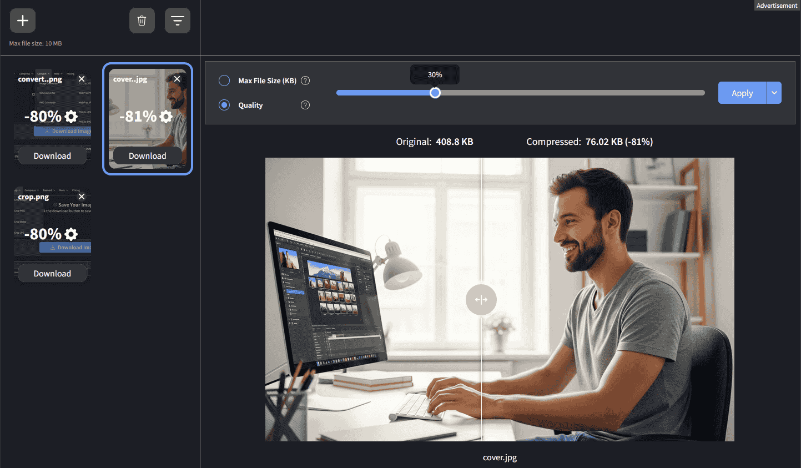
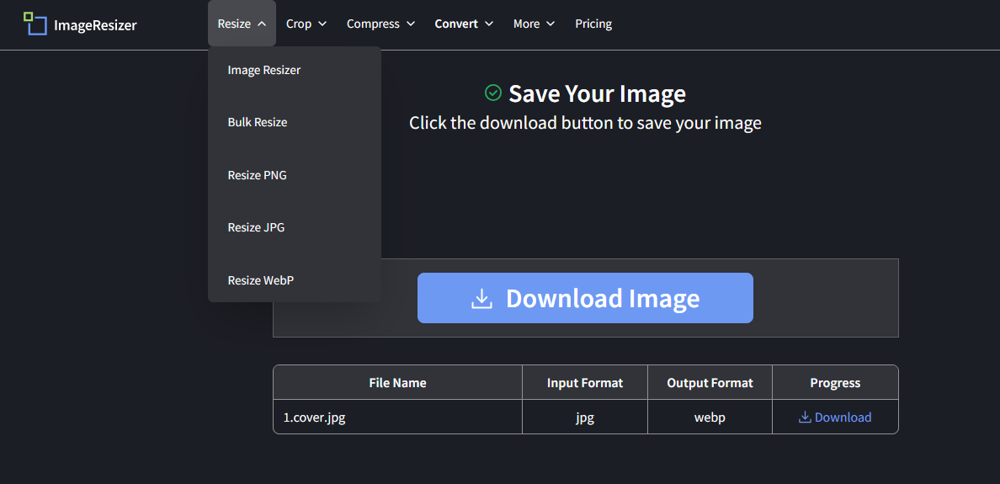
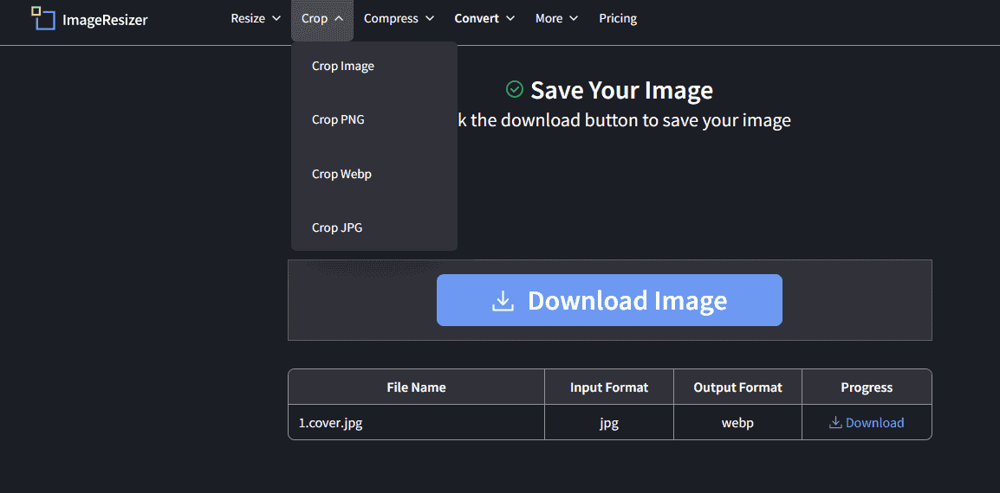
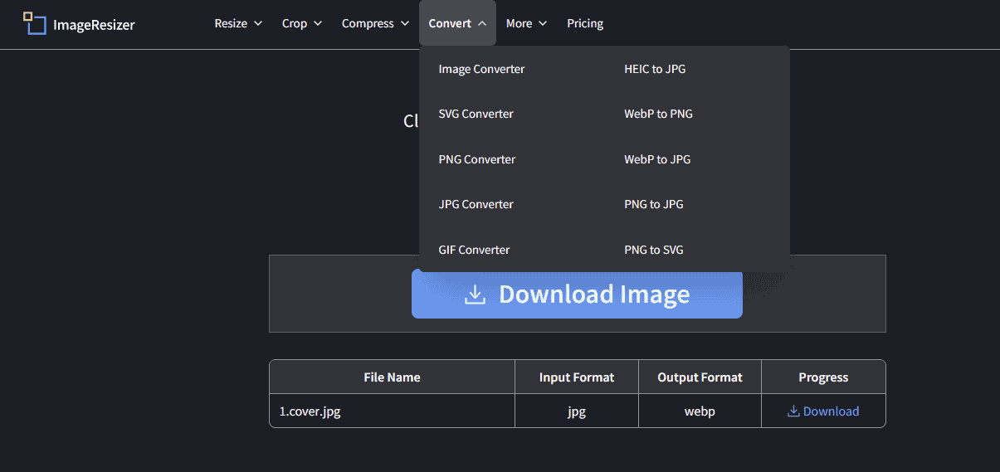

## Intro:

**ImageResizer.com** is a free, browser-based tool designed to simplify image editing tasks like resizing, converting, and compressing. With support for popular formats such as JPG, PNG, WEBP, GIF, and more, it allows users to quickly convert images between formats without installing any software. Whether you're optimizing images for the web, social media, or presentations, ImageResizer.com offers a fast, no-login-required solution with a clean and user-friendly interface.

## Compression:

The **image compression** feature stands out as one of its most powerful tools. As shown in the screenshot, it can reduce file size by up to **50% or more** while preserving excellent visual quality — a crucial benefit for web developers, bloggers, and designers who need fast-loading images without sacrificing appearance. You can compress based on **file size** or **quality level**, and the real-time comparison slider helps you visually confirm that the compressed version looks nearly identical to the original. This balance between file size reduction and image clarity is what makes ImageResizer.com especially useful.

## Image Resizing:

The **resizing feature** is both flexible and straightforward. Users can resize images by custom dimensions or by predefined ratios, making it ideal for various platforms or responsive design needs The screenshot highlights core functionalities, including dedicated options for **Image Resizing** and **Bulk Resize** within a clear dropdown menu. This allows users to easily resize images by specific file types such as **PNG**, **JPG**, and **WebP**. The tool's integrated capabilities are further showcased in the table, where an image originally in `JPG` format has been resized and converted to `WebP`, demonstrating its ability to handle multiple tasks in a single workflow. Once the process is complete, the user is prompted to **Download Image**, making it a simple and efficient one-stop solution for quick editing and format conversion.

## Image Croping:

The **cropping features** are well-organized and format-specific, giving users precise control over their edits. From the **Crop** dropdown, users can choose to crop images universally or target specific formats like **PNG**, **WebP**, and **JPG** — a thoughtful touch that ensures compatibility and optimization for each file type.

This structured approach is especially useful if you're dealing with transparency (like PNGs or WebPs) or format-specific constraints. The tool allows users to cut out unwanted sections or focus on a particular part of the image quickly before downloading the result in the desired format, as shown in the output table (`jpg → webp`).

It's simple, fast, and doesn’t require advanced editing knowledge — ideal for quick adjustments in blog images, social media content, or thumbnails.

## Image Converter:

The Image Resizer's "Convert" section is a simple yet powerful tool for handling all your image format needs. It effortlessly transforms images between popular formats like HEIC to JPG, WebP to PNG, and PNG to SVG. This feature is crucial for ensuring your photos are compatible with various platforms and for optimizing file sizes, making it an indispensable tool for anyone who works with digital images.

With this feature, you can effortlessly **convert between major image formats** such as JPG, PNG, WebP, GIF, and more. For example, you can upload a `.jpg` file and download it instantly as `.webp`, as shown in the screenshot. This is particularly valuable for web developers and bloggers, since **WebP offers significantly smaller file sizes** without sacrificing quality — boosting page load speed and Core Web Vitals.

## Conclution:

In today's digital world, images are everywhere, and their quality and performance are more critical than ever. Resizing, cropping, converting, and compressing aren't just technical steps—they're essential practices for optimizing images. Whether it's to reduce a file's size for faster website loading, crop a photo for a social media profile, or convert a format for compatibility, these actions directly impact user experience and efficiency.

Fortunately, you no longer need to be a professional designer or invest in costly, heavy software to get the job done. User-friendly, out-of-the-box online tools have revolutionized this process. They provide a streamlined, intuitive interface that allows anyone to perform complex image manipulations instantly, with just a few clicks. This accessibility empowers individuals and businesses alike to maintain high-quality visuals without the steep learning curve or high costs, making professional-grade image management accessible to all.

## 🔒 **Bonus Tip:**

 If you've been using ImageResizer.com frequently, you might have noticed a **daily usage limit** that restricts the number of images you can edit in a single day. In my next article, I’ll show you a simple and effective way to **bypass this limit** so you can convert, resize, and compress **unlimited images without interruptions** — all while staying within safe and ethical usage. Stay tuned!